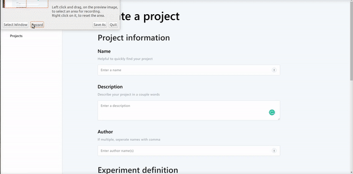

# pdf2data : A pdf segmentation and annotation tool for archival documents.

## 🚧 IN DEVELOPMENT 🚧

## From the [Chair of Systems Design, ETHZ](https://www.sg.ethz.ch/) and the [Swiss Data Science Center](https://datascience.ch/).

## 💡 Vision

> Develop an <orange>open source</orange> and <orange>user-friendly</orange> tool for <green>technical</green> and <green>non-technical</green> users that performs <purple>page, block & textline</purple> <red>segmentation</red> and combines both <turquoise>manual & automatic</turquoise> annotation.

## 🎥 Preview



## 🔥 Features

- **Structure** your work into project and case studies.
- **Upload** your pdf files.
- **Annotate** the results of the segmentation algorithm using the interactive dashboard.
- **Automate** the training of a classification algorithm.
- **Export** your results for further analysis.

## 🚀 Quickstart

### Development

Start the message broker:

```bash
docker-compose up
```

Start the backend:

```bash
source server/venv/bin/activate
make run
```

Start the worker:

```bash
source server/venv/bin/activate
make worker
```

Start the client:

```bash
cd client
yarn start
```

## 🧮 Data Composition

<image src="./docs/structure.png" width=600 alt="Data composition"/>

## 📚 Stack

<image src="./docs/architecture.png" width=600 alt="Architecture"/>

- **Node.js** and **React.js** deliver the interactive dashboard.
- **Tornado** runs the data backend.
- **Celery** with a **RabbitMQ** backend operates the execution of asynchronous tasks.
